<p align="center">
  
</p>

# MAESTRO: 您的自托管 AI 研究助手

[](https://www.gnu.org/licenses/agpl-3.0)
[](https://github.com/murtaza-nasir/maestro.git)
[](https://hub.docker.com/r/yourusername/maestro)

> **⚠️ 版本 0.1.3 - 破坏性变更 (2025/08/15)**
>
> 从 SQLite/ChromaDB 完全迁移到带有 pgvector 的 PostgreSQL。
> - **所需操作**：如果升级，您必须使用 `docker compose down -v` 从头开始重建
> - **新要求**：带有 pgvector 扩展的 PostgreSQL（包含在 Docker 设置中）
> - **安全性**：所有凭据现在都可以通过环境变量配置

MAESTRO 是一个由 AI 驱动的研究平台，您可以将其托管在自己的硬件上。它旨在在协作、多用户环境中从头到尾管理复杂的研​​究任务。规划您的研究，让 AI 代理执行，并观察它们根据您的文档和网络资源生成详细报告。

<p align="center">
  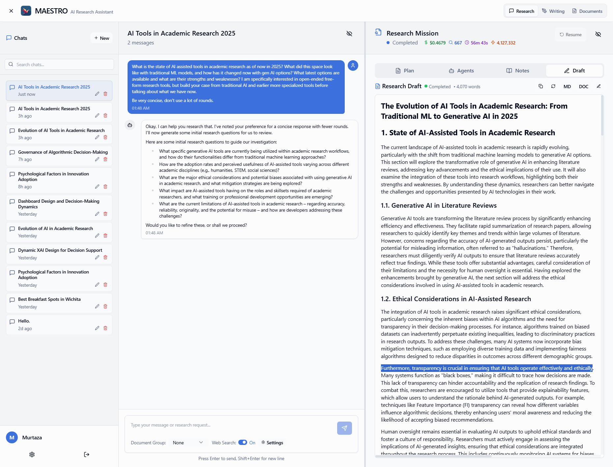
</p>

## 一种新的研究方式

MAESTRO 通过统一的、聊天驱动的工作流程简化了研究过程。定义您的研究目标，上传您的源材料，然后让一组 AI 代理来处理繁重的工作。对于任何处理大量信息的人来说，它都是一个强大的工具，从学者、分析师到作家和开发人员。

### 核心功能

<details>
  <summary><strong>管理您的文档库</strong></summary>
  <br>
  <p>在一个中心库中上传和管理您的 PDF 文档。MAESTRO 的高级检索增强生成 (RAG) 管道针对学术和技术论文进行了优化，确保您的 AI 代理可以访问正确的信息。</p>
  <p align="center">
    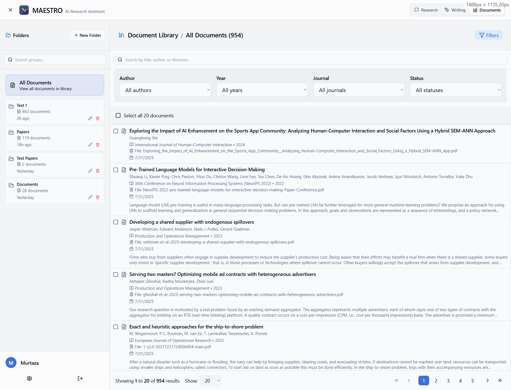
  </p>
</details>

<details>
  <summary><strong>创建聚焦文档组</strong></summary>
  <br>
  <p>通过为特定项目创建文档组来组织您的库。这使您可以指导 AI 从一组精选的来源中提取信息，确保其研究的相关性和准确性。</p>
  <p align="center">
    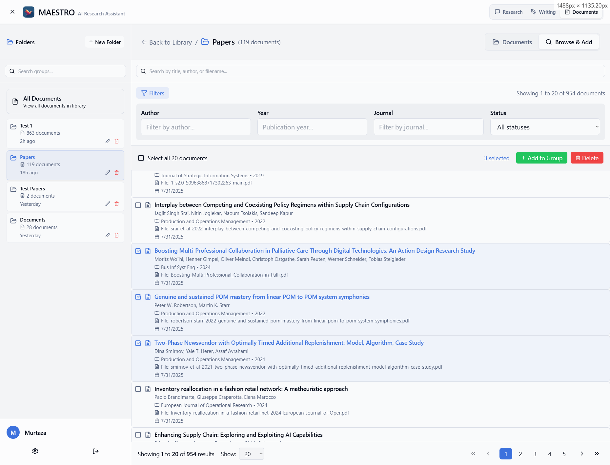
  </p>
</details>

<details>
  <summary><strong>自定义您的研究任务</strong></summary>
  <br>
  <p>通过为任务设置特定参数来微调研究过程。您可以定义 AI 调查的范围、深度和重点，以满足您的确切需求。</p>
  <p align="center">
    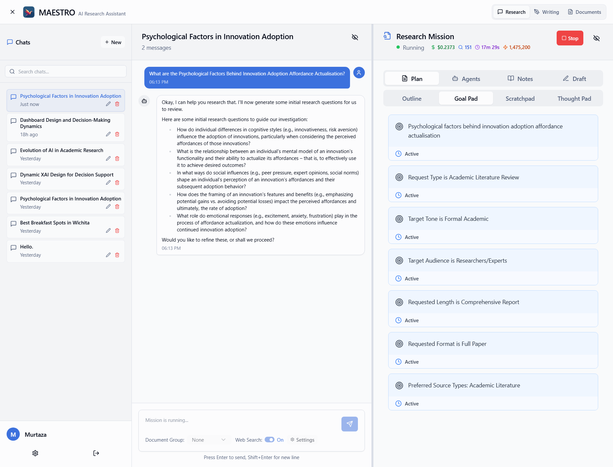
  </p>
</details>

<details>
  <summary><strong>与您的文档和网络聊天</strong></summary>
  <br>
  <p>使用聊天界面提出问题并直接从您的文档或互联网获取答案。这是一种获取快速见解或工作灵感的强大方式。</p>
  <p align="center">
    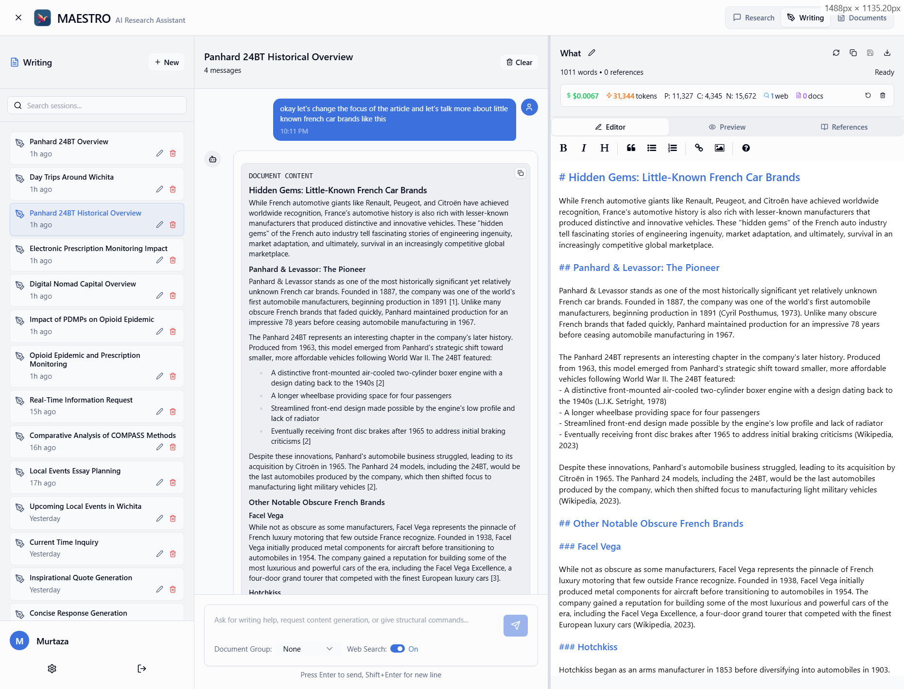
  </p>
</details>

<details>
  <summary><strong>获得写作助手的帮助</strong></summary>
  <br>
  <p>写作助手与您并肩工作，随时准备从您的图书馆或网络中提取信息，帮助您起草笔记、总结发现或克服写作障碍。</p>
  <p align="center">
    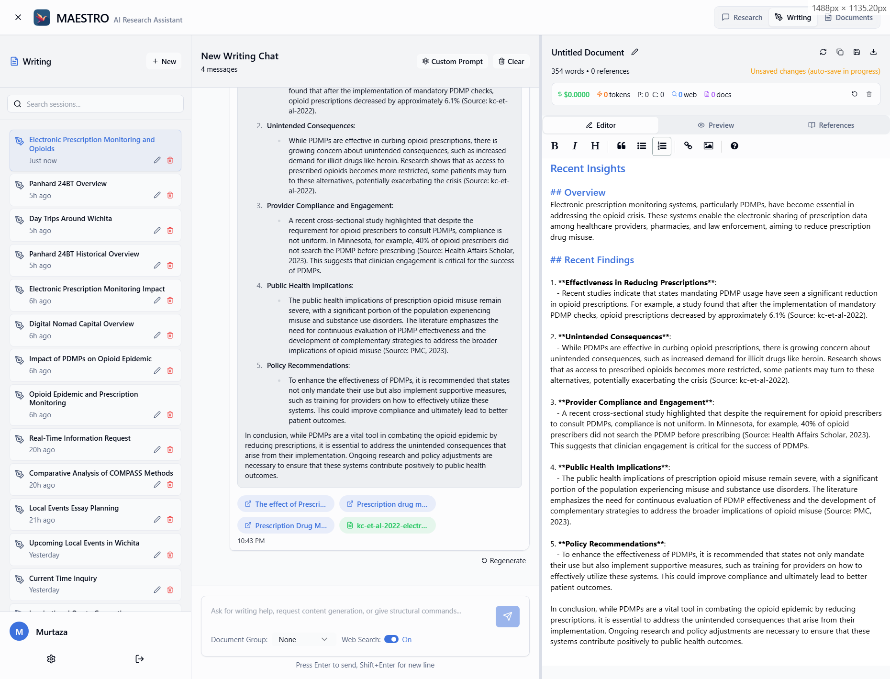
  </p>
</details>

<details>
  <summary><strong>跟踪代理的研究路径</strong></summary>
  <br>
  <p>MAESTRO 完全透明地展示了 AI 的过程。您可以查看它制定的研究大纲，并跟踪它探索不同调查途径的过程。</p>
  <p align="center">
    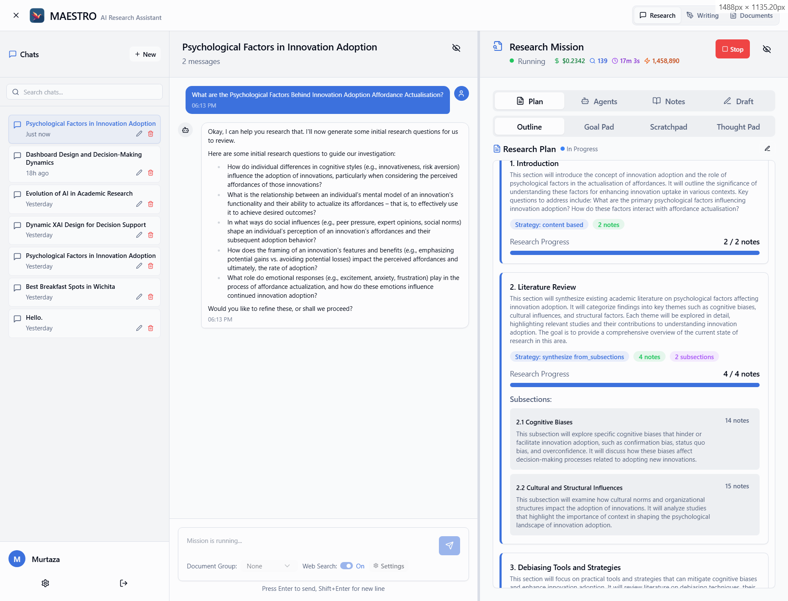
  </p>
</details>

<details>
  <summary><strong>查看 AI 生成的笔记</strong></summary>
  <br>
  <p>让研究代理深入您的 PDF 集合或在线查找新来源。然后，它将根据您的研究问题综合信息并生成结构化笔记。</p>
  <p align="center">
    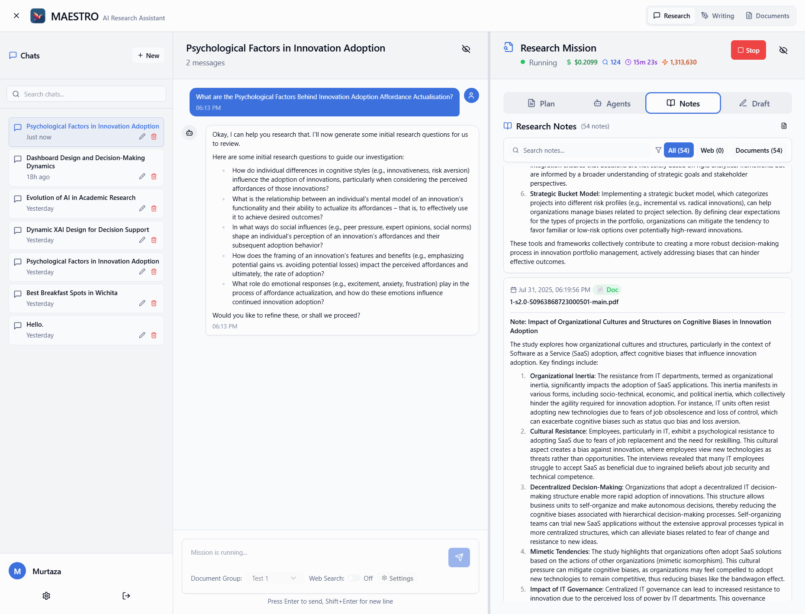
  </p>
</details>

<details>
  <summary><strong>详细跟踪任务进度</strong></summary>
  <br>
  <p>密切关注研究任务的每一步。该系统提供详细的、实时的代理活动和状态更新跟踪。</p>
  <p align="center">
    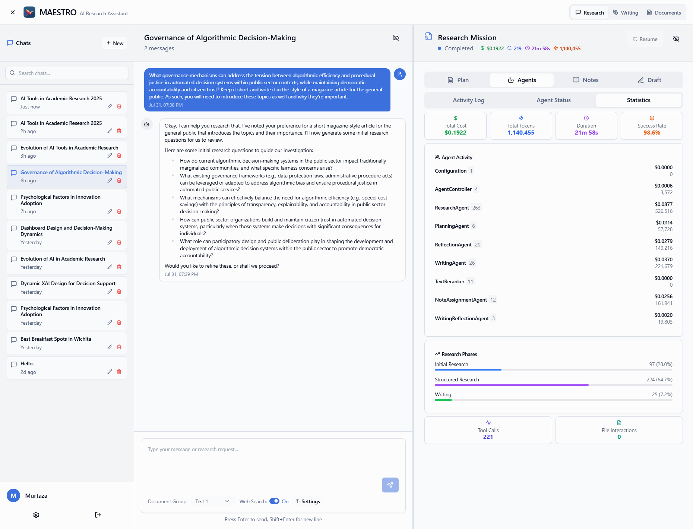
  </p>
</details>

<details>
  <summary><strong>理解代理的推理</strong></summary>
  <br>
  <p>AI 代理提供详细的思考笔记，让您深入了解它们的思维过程、做出的决策以及从数据中得出的结论。</p>
  <p align="center">
    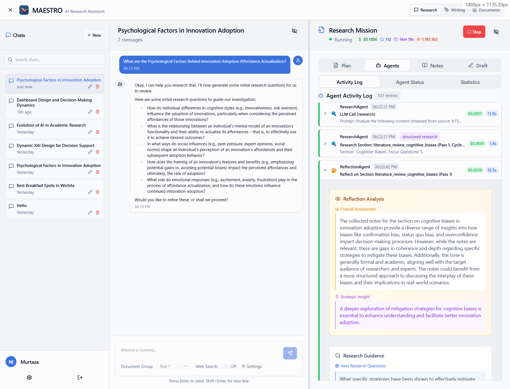
  </p>
</details>

<details>
  <summary><strong>获取包含参考文献的完整报告</strong></summary>
  <br>
  <p>根据研究计划和生成的笔记，将生成最终草稿，其中包括来自您的文档和互联网来源的参考文献。</p>
</details>

<details>
  <summary><h2>工作原理：WRITER 代理框架</h2></summary>
  <br>

MAESTRO 是一个复杂的多代理系统，旨在自动化复杂的研究综合。MAESTRO 不使用单一的 AI 模型，而是采用一支由专业 AI 代理组成的团队，它们协同合作以规划、执行、评论和撰写研究报告。

这种方法确保了从最初的问题到最终的、基于证据的报告的结构化、透明和严谨的过程。

<p align="center">
  <em>MAESTRO 研究生命周期</em>
</p>
<p align="center">

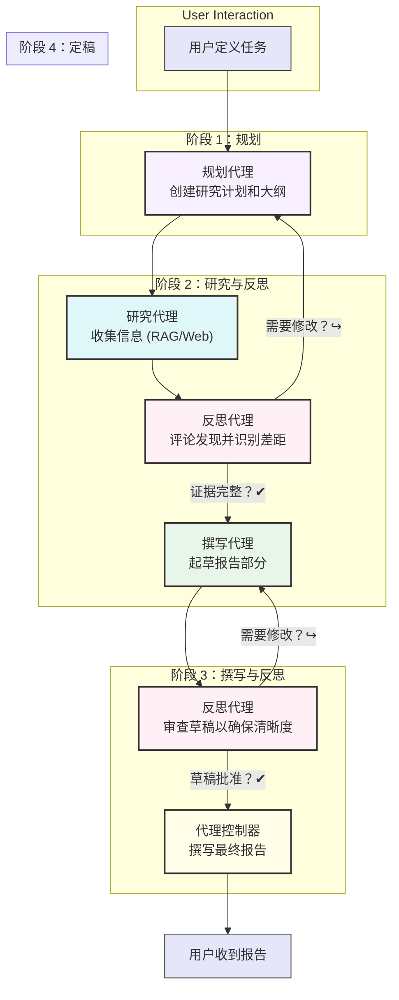
</p>

### 核心代理团队

MAESTRO 的能力由一组专业代理驱动，每个代理都有明确的角色：

*   **代理控制器（编排者）：** 管理整个任务，将任务委托给适当的代理，并确保工作流程从一个阶段顺利进行到下一个阶段。
*   **规划代理（战略家）：** 接受用户的初始请求，并将其转换为结构化的、分层的研究计划和报告大纲。这为任务创建了清晰的路线图。
*   **研究代理（调查员）：** 通过收集信息来执行研究计划。它使用其工具——本地 RAG 管道和网络搜索——来查找相关证据并将其组织成结构化的 `ResearchNote` 对象。
*   **反思代理（批判性审查员）：** 这是 MAESTRO 分析深度的关键。反思代理不断审查其他代理的工作，识别知识空白、不一致之处或与计划的偏差。其反馈推动了迭代循环，从而完善和提高研究质量。
*   **撰写代理（合成者）：** 获取整理好的研究笔记，并将其编织成一个连贯的、结构良好的叙述，遵循报告大纲。

### 研究过程：迭代与完善

研究过程并非线性；它是一系列迭代循环，旨在模拟批判性思维并确保高质量的成果。

1.  **研究-反思循环：**
    研究代理不只是一次性收集信息。在初步研究之后，反思代理会介入评论研究结果。它会提出以下问题：
    *   *证据是否存在空白？*
    *   *来源是否相互矛盾？*
    *   *是否出现了新的、意想不到的主题？*
    基于此评论，反思代理可以推荐新的研究任务，甚至促使规划代理修改整个计划。此循环持续进行，直到证据全面且可靠。迭代次数是动态的，取决于主题的复杂性。

2.  **撰写-反思循环：**
    起草也是一个迭代过程。一旦撰写代理生成了报告的一部分，反思代理会对其进行审查，以确保：
    *   **清晰度和连贯性：** 论点是否易于理解？
    *   **逻辑流畅性：** 思想是否逻辑连接？
    *   **与来源的忠实度：** 撰写是否准确地代表了 `ResearchNote` 中的证据？
    然后，撰写代理会根据此反馈修改草稿。此循环重复进行，直到撰写达到所需的质量和准确性标准。

这种结构化的、反思性的、迭代的过程使 MAESTRO 能够超越简单的信息聚合，并产生复杂、可靠且可审计的研究综合。
</details>

## 入门

MAESTRO 设计为使用 Docker 运行的容器化应用程序。

### 先决条件

*   **Docker** 和 **Docker Compose** (v2.0+)
*   **Git** 用于克隆存储库
*   **带 pgvector 扩展的 PostgreSQL**（通过 Docker 自动提供）
*   **磁盘空间**：AI 模型约 5GB + 数据库约 2GB

#### 硬件要求

*   **推荐**：支持 CUDA 的 NVIDIA GPU 以获得最佳性能
*   **最低**：所有平台均支持纯 CPU 操作
*   **平台支持**：
    - **Linux**：使用 nvidia-container-toolkit 实现完全 GPU 支持
    - **macOS**：CPU 模式（针对 Apple Silicon 和 Intel 优化）
    - **Windows**：通过 WSL2 实现 GPU 支持

## 快速开始

**最简单的入门方式：**

```bash
git clone https://github.com/murtaza-nasir/maestro.git
cd maestro
./setup-env.sh    # Linux/macOS
# 或者 setup-env.ps1 # Windows PowerShell
docker compose up -d
```

**⚠️ 首次运行：** 首次启动需要 5-10 分钟下载 AI 模型。使用以下命令监控进度：
```bash
docker compose logs -f maestro-backend
# 等待："Application startup complete"
```

通过 **http://localhost** 访问 MAESTRO

**默认凭据**（首次登录后立即更改）：
- 用户名：`admin`
- 密码：设置期间生成（检查您的 `.env` 文件）或如果未使用设置脚本则为 `admin123`

### 安装

#### Linux/macOS

1.  **克隆存储库**
    ```bash
    git clone https://github.com/murtaza-nasir/maestro.git
    cd maestro
    ```

2.  **配置您的环境**
    运行交互式设置脚本：
    ```bash
    ./setup-env.sh
    ```
    从三个简单选项中选择：
    - **简单**（仅限 localhost）- 推荐给大多数用户
    - **网络**（从网络上的其他设备访问）
    - **自定义域**（用于反向代理设置，如 researcher.local）

3.  **启动 MAESTRO**
    ```bash
    # 推荐：自动 GPU 检测
    ./start.sh
    
    # 或者手动：
    docker compose up -d
    ```
    
    **⚠️ 重要提示 - 首次启动：**
    首次运行时，后端需要下载 AI 模型（文本嵌入器等），这可能需要 **5-10 分钟**。在此期间：
    - 前端将可访问，但登录会失败
    - 您将看到“网络错误”或登录失败
    - 这是正常的！后端仍在下载所需的模型
    
    **监控启动进度：**
    ```bash
    # 观察后端日志
    docker compose logs -f maestro-backend
    
    # 等待此消息：
    # "INFO:     Application startup complete."
    # 或 "Uvicorn running on http://0.0.0.0:8000"
    ```

#### Windows

1.  **克隆存储库**
    ```powershell
    git clone https://github.com/murtaza-nasir/maestro.git
    cd maestro
    ```
    
    **对于 Windows/WSL 用户重要：** 如果您遇到“bad interpreter”错误，请运行：
    ```powershell
    # 在设置之前修复行尾
    .\fix-line-endings.ps1
    ```

2.  **配置您的环境**
    运行交互式设置脚本：
    ```powershell
    # 使用 PowerShell（推荐）
    .\setup-env.ps1
    
    # 或者使用命令提示符
    setup-env.bat
    ```
    从三个简单选项中选择：
    - **简单**（仅限 localhost）- 推荐给大多数用户
    - **网络**（从网络上的其他设备访问）
    - **自定义域**（用于反向代理设置）

3.  **启动 MAESTRO**
    ```powershell
    # 对于没有 GPU 的 Windows/WSL：
    docker compose -f docker-compose.cpu.yml up -d
    
    # 或者支持 GPU（如果可用）：
    docker compose up -d
    ```
    
    **⚠️ 重要提示 - 首次启动：**
    首次运行时，后端需要下载 AI 模型（文本嵌入器等），这可能需要 **5-10 分钟**。在此期间：
    - 前端将可访问，但登录会失败
    - 您将看到“网络错误”或登录失败
    - 这是正常的！后端仍在下载所需的模型
    
    **监控启动进度：**
    ```powershell
    # 观察后端日志
    docker compose logs -f maestro-backend
    
    # 等待此消息：
    # "INFO:     Application startup complete."
    # 或 "Uvicorn running on http://0.0.0.0:8000"
    ```

#### 访问 MAESTRO

一旦后端显示“Application startup complete”，请通过设置脚本显示地址（默认：`http://localhost`）访问 Web 界面。

**默认登录：**
- 用户名：`admin`
- 密码：`admin123`

**重要提示：** 首次登录后立即通过“设置”→“个人资料”更改默认密码。

有关配置 MAESTRO 设置和使用所有功能的详细说明，请参阅 [`USER_GUIDE.md`](./USER_GUIDE.md)。

## 架构与网络

MAESTRO 现在使用**统一的反向代理架构**来消除 CORS 问题：

- **单一入口点**：所有内容都通过一个端口（默认：80）访问
- **无 CORS 问题**：前端和后端从同一来源提供服务
- **简单配置**：一个主机，一个端口进行配置
- **高效路由**：nginx 有效处理静态文件和 API 路由

### 网络访问选项

1. **仅限 localhost**（默认）：从同一台计算机访问
2. **网络访问**：从网络上的其他设备访问
3. **自定义域**：与反向代理一起使用（例如，researcher.local）

### 故障排除

**Windows/WSL：后端无法启动（“bad interpreter”错误）？**
- 这是一个行尾问题。使用以下命令修复它：
  ```powershell
  .\fix-line-endings.ps1
  docker compose down
  docker compose build --no-cache maestro-backend
  docker compose up -d
  ```

**无法使用 admin/admin123 登录？**
- 使用内置脚本重置管理员密码：
  ```bash
  # 运行重置脚本（已在容器中）
  docker exec -it maestro-backend python reset_admin_password.py
  
  # 或者使用自定义密码：
  docker exec -it maestro-backend python reset_admin_password.py YourNewPassword
  
  # 或者使用环境变量：
  docker exec -it maestro-backend bash -c "ADMIN_PASSWORD=YourNewPassword python reset_admin_password.py"
  ```

**不使用 GPU？**
- 使用纯 CPU 的 compose 文件：
  ```powershell
  docker compose -f docker-compose.cpu.yml up -d
  ```
  对于没有 GPU 支持的 Windows，所有 Docker 命令始终使用 `-f docker-compose.cpu.yml`。

**无法从其他设备访问？**
- 使用“网络”选项重新运行设置脚本
- 检查防火墙设置
- 确保 Docker 容器正在运行：`docker compose ps`

**仍然看到 CORS 错误？**
- 旧配置可能存在冲突。尝试：`docker compose down && docker compose up --build -d`
- 检查您是否通过正确的端口访问

**出现 504 网关超时错误？**
- 如果在反向代理（nginx、Apache 等）后面运行，您需要增加超时设置
- 默认代理超时 (60s) 对于 AI 操作来说太短
- 有关详细说明，请参阅 [反向代理配置](./DOCKER.md#reverse-proxy-timeout-issues)
- 应用程序会优雅地处理超时，但正确的配置可以改善用户体验

**从 v0.1.2 或更早版本（SQLite/ChromaDB）迁移：**
- **重要提示**：这是一个破坏性更改 - 没有自动迁移可用
- 您必须使用 `docker compose down -v` 从头开始，以删除旧卷
- 重新运行设置脚本以生成新的 `.env`，其中包含安全密码
- 所有数据都将丢失 - 请务必先备份任何重要文档
- 迁移后，所有数据都存储在带有 pgvector 的 PostgreSQL 中

**规划/大纲生成错误（本地 LLM 或大型研究任务）？**
- 如果您在使用规划代理时遇到大纲生成或规划阶段的错误
- 这通常发生在本地 LLM 或处理包含许多笔记的广泛研究时
- **解决方案**：减少“设置”→“研究参数”中的“规划上下文”参数
- 导航到“设置”→“研究”选项卡→“内容处理限制”部分
- 将“规划上下文”从默认 200,000 降低到更小的值（例如 100,000 或 50,000）
- 这会将大型规划任务拆分为更小、更易于管理批次
- 对于上下文窗口较小的本地 LLM 尤其重要

### GPU 支持和性能优化

MAESTRO 包括自动 GPU 检测和配置，以在不同平台上实现最佳性能。

#### 纯 CPU 模式

对于没有 GPU 或 GPU 支持存在问题的系统，您有两种选择：

**选项 1：使用纯 CPU 的 Docker Compose 文件（推荐）**
```bash
docker compose -f docker-compose.cpu.yml up -d
```
这是最干净的方法 - 它会从您的容器中完全删除 GPU 依赖项，使其更小并防止任何与 GPU 相关的错误。非常适合专用的纯 CPU 设置或没有 GPU 的服务器。

**选项 2：在您的 .env 文件中设置 FORCE_CPU_MODE**
```bash
# 添加到您的 .env 文件
FORCE_CPU_MODE=true
# 然后使用常规 docker compose
docker compose up -d
```
此方法将 GPU 库保留在容器中，但会告诉应用程序忽略它们。它在开发中很方便，您可能希望在不更改 compose 文件的情况下在 CPU 和 GPU 模式之间切换。

#### 带 GPU 检测的快速启动

```bash
# Linux/macOS：自动平台检测
./start.sh

# Windows：PowerShell
.\start.sh

# 停止服务
./stop.sh  # 或 Windows 上的 .\stop.sh
```

#### 平台特定 GPU 支持

**带 NVIDIA GPU 的 Linux：**
- ✅ 全面 GPU 加速，带自动检测
- ✅ 多 GPU 支持，带负载分配
- **要求**：安装 `nvidia-container-toolkit`
- **设置**：检测到 GPU 后自动启用 GPU 支持

**macOS（Apple Silicon 和 Intel）：**
- ✅ CPU 优化性能（无需 GPU 运行时）
- ✅ 针对 Apple Silicon 和 Intel Mac 均优化
- ✅ 通过 Docker Desktop 完全兼容

**带 WSL2 的 Windows：**
- ✅ 通过 WSL2 和 nvidia-container-toolkit 支持 GPU
- ✅ 兼容 NVIDIA GPU
- **要求**：启用 GPU 支持的 WSL2

#### 手动 GPU 配置

对于高级用户，您可以在 `.env` 中手动配置 GPU 设置：
```env
# GPU 设备分配 (0, 1, 2 等)
BACKEND_GPU_DEVICE=0
DOC_PROCESSOR_GPU_DEVICE=0
CLI_GPU_DEVICE=0
GPU_AVAILABLE=true
```

#### 性能提示

- **多 GPU**：将不同服务分配给不同 GPU
- **CPU 模式**：对于开发和较小工作负载仍然具有高性能
- **内存**：使用 `nvidia-smi` 监控 GPU 内存

#### GPU 问题故障排除

```bash
# 检查 GPU 检测
./detect_gpu.sh

# 在 Docker 中测试 GPU
docker run --rm --gpus all nvidia/cuda:11.0-base nvidia-smi

# 查看服务日志
docker compose logs backend
```

> **Windows 用户**：有关详细的 Windows 设置说明、故障排除和 CLI 用法，请参阅 [`WINDOWS_SETUP.md`](./WINDOWS_SETUP.md)。

## 数据库管理工具

<details>
  <summary><strong>数据库重置和一致性工具</strong></summary>
  <br>
  
  MAESTRO 使用带有 pgvector 扩展的 PostgreSQL 作为所有数据存储，包括向量嵌入。该系统包含强大的 CLI 工具用于数据库管理和一致性检查。

  ### 快速数据库操作
  ```bash
  # 检查数据库状态和一致性
  ./maestro-cli.sh reset-db --check
  
  # 获取数据库统计信息
  ./maestro-cli.sh reset-db --stats
  
  # 重置所有数据库（带备份）
  ./maestro-cli.sh reset-db --backup
  ```

  ### 文档一致性管理
  ```bash
  # 检查全系统文档一致性
  python maestro_backend/cli_document_consistency.py system-status
  
  # 清理孤立文档
  python maestro_backend/cli_document_consistency.py cleanup-all
  
  # 检查特定用户的文档
  python maestro_backend/cli_document_consistency.py check-user <user_id>
  ```

  ### 何时使用这些工具
  - **数据库重置**：完全重新开始，删除所有数据
  - **一致性工具**：有针对性的清理，保留有效数据
  - **自动监控**：内置系统每 60 分钟运行一次

  > 有关详细说明和高级用法，请参阅 [`README_DATABASE_RESET.md`](./README_DATABASE_RESET.md)

</details>

## 技术概述

MAESTRO 建立在现代、解耦的架构之上：

*   **后端**：使用 **FastAPI** 构建的强大 API，处理用户身份验证、任务控制、代理逻辑和 RAG 管道。
*   **前端**：使用 **React**、**Vite** 和 **TypeScript** 构建的动态响应式单页应用程序，使用 **Tailwind CSS** 进行样式设置。
*   **实时通信**：**WebSockets** 将实时更新、日志和状态更改从后端流式传输到前端。
*   **数据库**：**PostgreSQL** 和 **pgvector** 扩展用于所有数据存储，**SQLAlchemy** ORM 用于数据库管理。
*   **容器化**：**Docker Compose** 协调多服务应用程序以实现可靠部署。

### 完全自托管操作

MAESTRO 可以配置为完全自托管环境。它支持本地、OpenAI 兼容的 API 模型，允许您运行自己的 LLM。对于网络搜索，它与 **SearXNG** 集成，这是一个私有且可破解的元搜索引擎，确保您的整个研究工作流程可以保留在您自己的硬件上。

#### SearXNG 配置

如果您选择使用 SearXNG 作为您的搜索提供商，请确保您的 SearXNG 实例配置正确：

**所需配置：**
- 您的 SearXNG 实例必须支持 JSON 输出格式
- 在您的 SearXNG 设置中，在 `-html` 之后将 `-json` 添加到 `format` 部分

**SearXNG settings.yml 配置示例：**
```yaml
search:
  format:
    - html
    - json  # <- MAESTRO 集成需要此行
```

**可用搜索类别：**
MAESTRO 支持以下 SearXNG 类别，您可以在“设置”>“搜索”部分进行配置：
- 一般（默认）
- 科学
- IT
- 新闻
- 图片
- 视频
- 音乐
- 文件
- 地图
- 社交媒体

您可以选择多个类别，根据您的研究需求来优化搜索结果。

对于高级用户和管理员，提供强大的**命令行界面 (CLI)**，用于批量文档摄取、用户管理和其他管理任务。有关完整文档，请参阅 [`CLI_GUIDE.md`](./CLI_GUIDE.md)。

#### 快速 CLI 示例

**Linux/macOS：**
```bash
./maestro-cli.sh help
./maestro-cli.sh create-user researcher mypass123
./maestro-cli.sh ingest researcher ./documents
```

**Windows：**
```powershell
# 使用 PowerShell（推荐）
.\maestro-cli.ps1 help
.\maestro-cli.ps1 create-user researcher mypass123
.\maestro-cli.ps1 ingest researcher .\documents

# 或者使用命令提示符
maestro-cli.bat help
maestro-cli.bat create-user researcher mypass123
maestro-cli.bat ingest researcher .\documents
```

## 文档

- [`USER_GUIDE.md`](./USER_GUIDE.md) - 配置和使用 MAESTRO 功能的详细指南
- [`CLI_GUIDE.md`](./CLI_GUIDE.md) - 全面的命令行界面文档
- [`DOCKER.md`](./DOCKER.md) - 完整的 Docker 设置和部署说明
- [`WINDOWS_SETUP.md`](./WINDOWS_SETUP.md) - Windows 特定安装指南

## 许可证

本项目为**双重许可**：

1.  **GNU Affero 通用公共许可证 v3.0 (AGPLv3)**：MAESTRO 根据 AGPLv3 作为其开源许可证提供。
2.  **商业许可证**：对于无法遵守 AGPLv3 的用户或组织，提供单独的商业许可证。请联系维护者了解更多详情。

## 贡献

反馈、错误报告和功能建议非常有价值。请随时在 GitHub 存储库中提出问题。