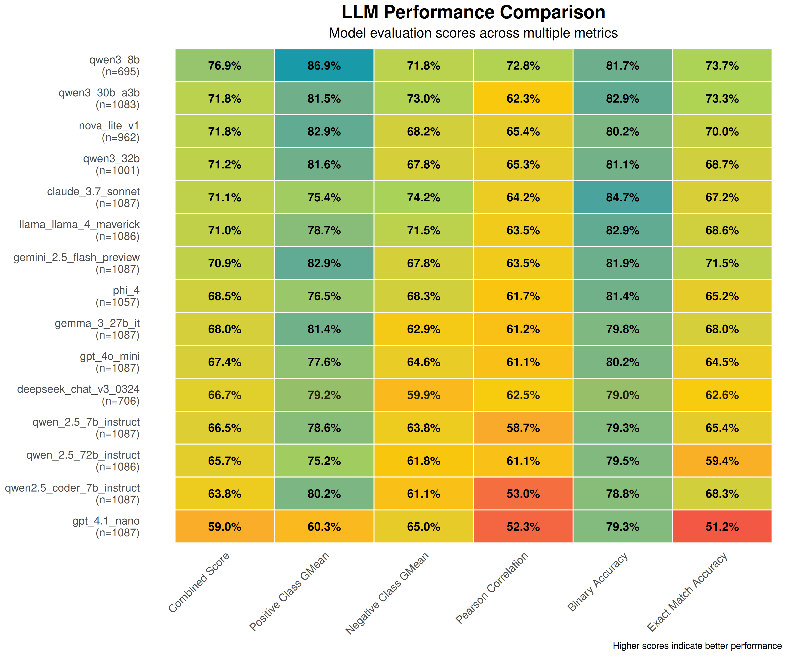
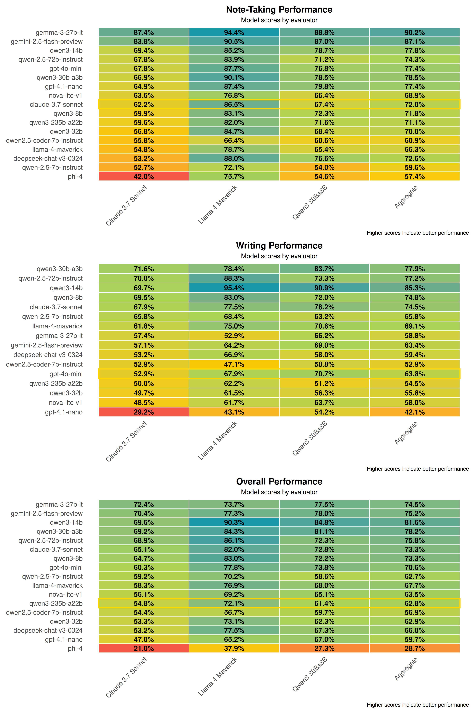

# MAESTRO：用于验证器角色和代理性能的 LLM 评估

为了确保 MAESTRO 研究框架能够产生高质量的事实表示，我们必须彻底评估其中 LLM 的性能。然而，衡量 AI 撰写的复杂摘要和综合报告的事实一致性本身就是一项艰巨的任务。

因此，作为初步步骤，我们正在尝试找到最可靠的 LLM 作为公正的“判断者”或“验证器模型”。**目前，此验证器模型或“LLM 即判断者”并非 MAESTRO 实时研究管道的活跃参与者。相反，这只是目前的初步评估阶段。** 我们目前的目标是找出哪些 LLM 更擅长判断来自多个来源的声明、摘要和信息综合。然后，这些“同类最佳”的验证器模型将用于为核心研究管道中 LLM 的输出提供基线和验证。我们打算在未来版本中直接将此类验证功能集成到 MAESTRO 工作流中（例如在反思代理中）。

## 验证器模型选择方法（LLM 即判断者）

我们选择“判断者”角色的初步方法是根据 Pearson 相关性和正负类别精确度和召回率的几何平均值，评估各种模型在 QAGS 等数据集上的事实一致性评估能力。这为我们提供了潜在候选对象的高级概述。

### 改进的验证器选择

除此之外，为了增加我们选择的鲁棒性，我们添加了一个新的**组合得分**。这是以下三个量的几何平均值：
1.  **正类几何平均值：** “正”类（例如，“是”或“支持”）的灵敏度（真阳性率）和精确度的几何平均值。
2.  **负类几何平均值：** “负”类（例如，“否”或“驳斥”）的特异性（真阴性率）和负预测值的几何平均值。
3.  **Pearson 相关性：** 模型得分与人类判断之间的线性相关性。

**组合得分背后的推理：** 我们选择这个基于几何平均值的组合得分，是因为我们需要验证器模型不仅要擅长识别明确支持（正）或明确驳斥（负）的声明，还要正确识别部分支持的声明或信息不足的声明。几何平均值确保了在这些不同维度上的性能平衡，尤其是在评估声明准确性时（即完全支持、部分支持或根本不支持）。

脚本 `evaluation/verifier_verification.py` 用于针对各种数据集（QAGS、TreatFact、VitaminC）运行这些评估以获得这些指标。

**验证器模型候选性能（新组合得分）：**

*表格根据 positive_class_gmean、negative_class_gmean 和 pearson_correlation 的几何平均值生成。*

**最终验证器面板选择标准：**
1.  **良好性能：** 在新组合得分上排名靠前。
2.  **可靠性：** 在评估期间，OpenRouter API 服务拒绝或出错率低。（`qwen/qwen3_8b` 模型虽然组合得分很高，但在某些运行中成功评估的样本较少，这可能表明拒绝或错误率较高，因此，在面板中被降级）
3.  **提供商多样性：** 为了减少来自单个模型提供商或训练数据集的潜在系统偏差，我们确保了所选模型的提供商多样性。

尽管 `qwen/qwen3_8b` 得分很高，但由于其发布数据中的样本较少（由于测试时 API 的拒绝/错误率较高），并且为了确保提供商多样性，我们查看了下一个最佳模型。Qwen 系列中有两个模型（`qwen/qwen3_30b_a3b` 和 `qwen/qwen3_32b`）位居前列。为了避免单个系列的过度代表并确保提供商多样性，我们选择了一个更强的 Qwen 模型。

**选定的验证器面板：**

根据上述标准，选择以下三个模型作为我们用于评估其他 LLM 研究和写作能力的“判断者”面板：
1.  **`qwen/qwen3-30b-a3b`**
2.  **`anthropic/claude-3.7-sonnet`**
3.  **`meta-llama/llama-4-maverick`**

## LLM 在研究和写作任务中的性能评估方法

**关于模型版本：** 本研究中评估的所有模型都使用了其经过指令微调的版本，这些版本针对遵循指令和会话交互进行了优化。例如，测试的 Qwen 模型是指令变体（例如，`qwen/qwen3-30b-a3b` 指的是指令版本），所有其他评估中的模型也是如此。

为了评估各种 LLM 在潜在执行 MAESTRO 研究和写作任务时的输出事实准确性，我们使用了我们选择的三个验证器模型面板。评估由 `evaluation/llm_accuracy_test.py` 脚本进行，其中包括访问网络搜索和大约 1000 篇相关文章的 RAG 数据库。使用包含 10 个不同复杂程度问题的面板，评估包括针对每个测试 LLM 的 2 阶段过程：

1.  **阶段 1：笔记生成和验证（模拟研究代理）**
    *   对于每个研究问题，测试 LLM（作为使用 MAESTRO `ResearchAgent` 类的研究代理）会使用一些源材料（使用 MAESTRO 中当前包含的检索工具，即文档和网络搜索）并生成简短的“研究笔记”（`Note` 模式的实例）。
    *   然后，**每个生成的笔记都会由三个验证器模型中的每一个**根据其原始源上下文单独验证其事实准确性。验证器根据源上下文判断笔记为“是”（完全支持）、“否”（驳斥/矛盾）或“部分”（部分支持/信息不足）。

2.  **阶段 2：写作合成和声明验证（模拟写作代理）**
    *   阶段 1 中测试 LLM 生成的笔记会反馈给**同一个**测试 LLM，现在该 LLM 充当写作代理（使用 MAESTRO `WritingAgent` 类），以合成一篇著作。
    *   然后从这个合成的写作输出中提取单个声明。`extract_claims_from_writing` 函数返回看起来与引用相关的句子（例如，`[doc_id]`）。
    *   然后，**每个提取的声明都会由三个顶级验证器模型中的每一个**独立验证其事实准确性，并根据支持它的特定研究笔记（即，引用笔记的文本被认为是声明的上下文）。验证器将每个声明标记为“是”、“否”或“部分”。

**聚合验证器判断：**
然后，来自三个验证器模型的每个笔记或声明的最终得分用于计算最终的事实性得分。脚本 `evaluation/score_accuracy_results.py` 获取原始输出并对其进行处理。对于每个项目（笔记或声明），它根据验证器的决定计算一个数值得分（“是”= 1，“部分”= 0.5 或多引用写作的 `1/num_refs`，“否”= -1）。

结果表中的“聚合”得分是每个 LLM 在每个任务（笔记生成或写作）中所有三个验证器得分的总和。对于每个 LLM 的“总体”聚合得分，脚本会独立计算“笔记”和“写作”阶段的标准化得分，然后以统一加权平均它们，以在两个重要的研究任务中获得平衡的得分。

## 结果：LLM 在研究和写作任务中的表现

下表总结了各种 LLM 在笔记生成和写作合成任务中的表现，由我们的三成员验证器小组评估。得分以百分比表示，越高越好。“聚合”列显示了验证器小组的组合得分。

*注意：“聚合”得分是基于三个验证器模型的得分组合。“总体”得分是模型在“笔记”生成和“写作”合成阶段表现的 50-50 加权平均值。*

## MAESTRO 中代理角色的建议

使用我们的验证器模型小组，我们可以深入了解不同 LLM 在模拟研究/写作任务中的表现。

**观察结果：**
*   **Qwen 和 Google 系列的整体表现良好：** Qwen 系列的模型（例如，`qwen/qwen3-14b`、`qwen/qwen3-30b-a3b` 和 `qwen/qwen-2.5-72b-instruct`）以及 Google 的模型（例如，`google/gemini-2.5-flash-preview`、`google/gemma-3-27b-it`）在笔记生成（研究代理模拟）和写作合成（写作代理模拟）方面都表现出色，基于聚合得分。特别是 `qwen/qwen3-14b` 整体表现非常好。
*   **不同任务的弱点：** 某些模型在一个任务上比另一个任务更强。例如，`google/gemma-3-27b-it` 和 `google/gemini-2.5-flash-preview` 在“笔记”生成阶段表现非常好，而 `qwen/qwen3-14b` 在“写作”阶段根据聚合得分领先。
*   **成本效益选项：** `openai/gpt-4o-mini` 似乎是一个合理的模型，特别适用于简单的规划任务，并且可能是 MAESTRO 中 `FAST_LLM_PROVIDER` 角色的合理候选者。其总体得分似乎表明它是处理不太复杂任务的合理、低成本选项。
*   **验证器之间的意见差异：** 看到不同的验证器模型如何对相同的生成内容进行评分也很有趣。例如，平均而言，`meta-llama/llama-4-maverick` 似乎比 `anthropic/claude-3.7-sonnet` 分配更高的分数。这强调了验证器面板的价值，有助于缓解个体验证器的盲点。

**MAESTRO 代理角色的建议：**

MAESTRO 具有一个可配置的 LLM 名单，在您的 `.env` 文件中定义了三个级别：`FAST_LLM_PROVIDER`、`MID_LLM_PROVIDER` 和 `INTELLIGENT_LLM_PROVIDER`。这允许您根据任务的复杂性和成本考虑，有选择地将不同模型（或同一模型，如果您愿意）分配给不同的代理角色。虽然您不需要在这三个级别中使用三种不同的模型，但这种结构允许您灵活地根据自己的需求调整性能和预算。对于希望在本地运行模型的用户，我们还提供自托管建议，这将需要您方面的一些硬件和设置（例如，通过 Ollama、vLLM 等）。

根据我们上面的发现，我们建议以下选择 MAESTRO 代理角色模型的方法：

*   **规划代理 (`FAST_LLM_PROVIDER`)：** 此角色需要高效地组织任务并生成大纲。
    *   **最佳 API 选择：** `openai/gpt-4o-mini` 兼具能力和成本效益，非常适合频繁、计算开销较小的任务，例如规划。
    *   **自托管建议：**
        *   **`qwen/qwen3-8b`**：此模型在我们的基准测试中显示出与其大小相符的良好性能。它在规划任务的速度和能力之间取得了良好的平衡。
    *   **替代 API 选择：** 如果成本和 API 性能合理，高效的小型 Qwen 模型（例如，`qwen/qwen3-14b`，如果通过 API 访问）也可以使用。

*   **研究代理和写作代理 (`MID_LLM_PROVIDER`)：** 这些代理需要擅长理解、合成和生成，并具有良好的事实基础。
    *   **顶级 API 选择：**
        *   **Qwen 系列：** `qwen/qwen3-14b`、`qwen/qwen3-30b-a3b` 和 `qwen/qwen-2.5-72b-instruct` 显示出非常好的聚合性能。
    *   **强大的替代 API 选择：**
        *   **Google 模型：** `google/gemini-2.5-flash-preview` 和 `google/gemma-3-27b-it` 在准确的笔记生成方面表现尤其出色。
        *   `anthropic/claude-3.7-sonnet` 在笔记和写作方面一直表现出色。
    *   **自托管建议：**
        *   **`qwen/qwen3-14b`**：在我们的研究/写作测试中获得最高总体聚合分数，是具有挑战性的中级任务的绝佳自托管选项。
        *   **`google/gemma-3-27b-it`**：来自 Google 的一个非常强大的开放模型，表现也非常好，尤其是在笔记生成方面。它是 Qwen 模型的一个很好的自托管替代品。
        *   **`qwen/qwen3-30b-a3b`**：也是 Qwen 系列中一个非常强大的模型。
    *   **战略组合：** 考虑将 `google/gemini-2.5-flash-preview`（API）或自托管的 `google/gemma-3-27b-it` 用于研究代理（由于笔记得分高），并将 `qwen/qwen3-14b`（API 或自托管）用于写作代理（由于其写作得分高）。

*   **反思代理 (`INTELLIGENT_LLM_PROVIDER` 或功能强大的 `MID_LLM_PROVIDER`)：** 这是最重要代理，用于批判性地评估信息质量、识别知识空白并提出改进建议。它受益于具有强大推理和分析能力的模型，可能类似于在我们的验证器模型评估中表现出色的模型。
    *   **顶级 API 选择（利用验证器优势和整体性能）：**
        *   **验证器面板模型：** `qwen/qwen3-30b-a3b`、`anthropic/claude-3.7-sonnet`、`meta-llama/llama-4-maverick`。选择这些模型是因为它们具有强大的评估能力。
        *   **高性能验证器候选：** `google/gemini-2.5-flash-preview` 和 `qwen/qwen3-8b` 在验证器选择轮中也表现出非常出色的性能，并且是需要细致判断的反思任务的良好选择。
    *   **自托管建议：**
        *   **`qwen/qwen3-30b-a3b`**：作为我们验证器选择面板的成员，它在验证器候选和研究/写作任务中表现出非常强大的性能。其能力使其成为自托管反思代理的良好选择。
        *   **`meta-llama/llama-4-maverick`**：也是我们验证器面板的成员。
        *   **更大的 Qwen 模型（例如，`qwen/qwen-2.5-72b-instruct`）：** 更大的 Qwen 系列模型也可以为反思代理提供更好的推理能力。
        *   **`google/gemma-3-27b-it`**：虽然其验证器得分不如顶级验证器高，但其整体性能和开放性质使其成为在其他更大模型不可行时进行反思任务的良好自托管选项。

**一般建议：**
* **成本 vs. 准确性 vs. 基础设施：** 用户应查阅 MAESTRO 中详细的成本跟踪功能，并与这些性能指标进行交叉参考。每个层级的“最佳”模型将取决于特定的预算、所需的准确性水平以及用于自托管的可用基础设施。
* **迭代改进：** MAESTRO 管道旨在进行迭代研究。即使模型存在轻微的弱点，包含规划、研究、反思和写作循环的多代理系统也可以帮助缓解其中一些问题。反思代理在配备功能强大的 LLM 时，在此过程中扮演着关键角色。
* **持续评估：** LLM 格局正在迅速演变。这些建议基于当前数据（截至 2025 年 5 月），我们将继续评估可用的新模型。

## 未来工作

未来的工作将集中在：
*   直接在 MAESTRO 研究管道中添加一个强大的验证器代理，以提供实时事实检查。
*   持续更新我们对新模型和数据集的评估。
*   发布一份关于 MAESTRO 系统架构和这些实验发现的全面论文。

我们认为这些发现将帮助用户在配置 MAESTRO 以满足其特定研究用例时做出更明智的决策，同时考虑性能、成本和事实准确性。